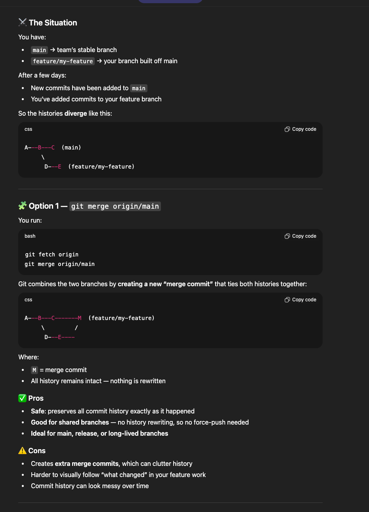

This file - is for quick walkthrough of the entire project.

Assume:
we are on main branch 
created a feature branch from main
now we apply our changes 
before push to remote repo
some dev has pushed some changes to remote
we need to take pull to reflect those

Remember: git pull is not possible when remote repo and your local branch has some changes need to be stashed before taking pull.

1. 
You’re on your feature branch (say feature/my-feature) and you ran:
git pull origin main

This tells Git:

“Please pull changes from the remote branch main into my current feature branch.” and merge them.

Git sees that:

- feature/my-feature has its own commits (you just committed your local work),
- main also has new commits from others.
- So now you have two separate lines of history — they’ve diverged.

Git doesn’t know if you want to:

Merge → combine them with a merge commit, or
Rebase → reapply your commits on top of main, or
Fast-forward only → only pull if no divergence.

So Git stops and shows that hint message.

Sol:
- You just need to tell Git explicitly how to combine them.
git fetch origin
git rebase origin/main

That will:
Get all latest commits from main
Replay(moves) your feature branch commits on top of that
Keep your history clean and linear

If you get merge conflicts:
git status        # shows conflicted files
# fix conflicts manually
git add <file>
git rebase --continue
once done:
git push --force-with-lease

2. When you run git pull origin main, you’re actually mixing two operations:
git fetch origin main
git merge FETCH_HEAD (or rebase, depending on config)

That’s why it’s often clearer to separate the steps:
git fetch origin
git rebase origin/main   # or merge if you prefer

